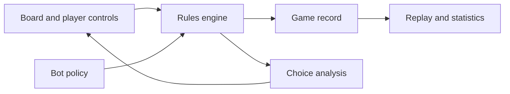

# Wild Rivers application handoff

The approved September 30 v3 presentation is implemented in the application, including subsequent feedback for separate two-, three-, and four-player board compositions, a straight Lake inlet, and thicker coloured Villager socket rims. [docs/presentation.md](docs/presentation.md) describes the current board, persistent player column, setup acknowledgements, movement, compact-screen controls and verification. [The approved v3 handoff](docs/mockups/approved-rounds-v3/HANDOFF.md) remains the visual reference. The rules/content version remains `prototype-2026.1`; setup presentation does not draw new outcomes or change replay history.

## Goal

Build a responsive, local-first web game called Wild Rivers for computer and tablet. Complete human play, scoring, save/resume, and a basic computer opponent before pursuing optimal strategy. Make the game a learning tool: players should be able to inspect why a bot prefers an action and explore probability, opportunity cost, and uncertainty.

The project rules and research are in [rules.md](docs/rules.md), [physics.md](docs/physics.md), and [strategy.md](docs/strategy.md). Treat `rules.md` as the rules authority and `strategy.md` as guidance for bot decisions.

## Starting stack

| Area | Choice |
|---|---|
| App | React, TypeScript, Vite, plain CSS |
| Board | Inline SVG for the fixed board; HTML controls for choices and information |
| Rules and game state | Plain TypeScript rules engine, separate from React; React `useReducer` for the active game |
| Local records | IndexedDB through `idb` |
| Statistics | Derived from saved records; simple HTML/CSS or SVG displays initially |
| Bots | Replaceable TypeScript policies using the same legal actions as people |

Use built-in browser capabilities where sufficient. A Web Worker is appropriate if later bot search or batches of simulated games block the interface. Add installability and offline asset caching after the web game is pleasant to use. Defer a chart library, canvas framework, dedicated state store, and game framework until a specific need appears.

## Architecture boundaries

- The rules engine owns setup, legal actions, phase transitions, river flow, collection choices, scoring, and game end. Board drawing and bot policy must not define rules.
- Represent the printed river board as fixed topology data. Pearls follow its connections deterministically; their physical rolling is not an extra random event.
- Keep component definitions separate from player-owned instances. Identify each ruleset and content set with a version so old saves remain understandable.
- Record meaningful player and bot choices as actions and the resulting events. A saved game should include rules/content version, random seed or shuffled orders, policy versions, action history, and final score breakdown.
- Keep independent, specified random streams for pearls, Fairies, Villagers, Camp cards, and starting order. Draws are without replacement where the rules require it. Replay must not depend on an unspecified browser random sequence.
- Bots and player hints may see only information available to that player at the decision point, even though a save contains hidden deck orders.

## Delivery stages

### 1. Establish playable content

Complete the missing component information listed in `physics.md`: board sections, legal slots, costs and connections; Villager tile faces and copy counts; Alpaca goal requirements; and Camp-card type counts. Validate that a content set is complete before calling the content complete. If the family plays before transcription is complete, identify that content and its saved games as a **prototype ruleset**.

**Done when:** A complete, identified content set can support setup through final scoring without invented component values being mistaken for confirmed ones.

### 2. Complete local human play

Support two to four local players through all five rounds: Preparation, Exploration, Collection, delivery, and final scoring. Show legal choices clearly on computer and tablet. Tapping must suffice for play; dragging is optional. Include save/resume and a score breakdown.

**Done when:** People can finish a complete local game and understand how each score was earned.

### 3. Record and replay games

Save the active game and completed games. Preserve choices and random outcomes so a game can be stepped through later. Derive initial statistics such as games played, wins, scores, and score sources from completed records.

**Done when:** A saved game resumes, and a completed game can be replayed with the same result.

### 4. Add computer opponents

Start with a bot that always selects legal actions and completes games. Then add a named, versioned heuristic policy that considers usable pearl value, Villager space and bonuses, Alpaca capacity and goals, Camp-card cost and pairs, Fairies, turn order, and contested opportunities described in `strategy.md`. Each policy should provide a concise rationale and the main factors behind its choice. Strong search and self-play can wait.

**Done when:** Players can finish a game against a bot, and its decisions can be inspected afterward.

### 5. Add the learning coach

At placement, pearl selection, Villager recruitment, and delivery decisions, offer a small explanation: one suggested action, one plausible alternative, and two or three reasons. After a player acts, allow a gentle review. Phrase conclusions as comparisons with the **current policy's estimate**, not claims of optimal play.

For example: “The upstream space can catch the visible purple pearl, but costs two more Camp cards. Your choice keeps those cards for a matching pair.”

Every probability or forecast shown to a player needs a visible label:

- **Exact draw chance:** computed from remaining supply counts, with draws without replacement. Example: 3 white pearls among 20 remaining gives a 15% chance that the *next* pearl drawn is white.
- **Certain board result:** follows from public pearls, placements, and fixed river paths under the rules.
- **Estimated opponent choice:** produced by a named bot model with stated assumptions. It is a forecast, not a rule.

Keep the explanation record independent of its wording: action considered, factors and values, assumptions, policy version, and a short player-facing summary. The same information can serve hints, post-turn reviews, and replays. Show uncertainty when future opponent choices or unknown draws affect the ranking. A lucky result should not be presented as proof that a risky decision was good.

**Done when:** A player can inspect an important choice and tell which statements are facts, exact probabilities, and estimates.

### 6. Explore game theory

Compare two legal choices from the same public position. Show trade-offs such as immediate points versus card cost, storage capacity, future turn order, and denying an opponent a scarce slot. Later, compare policy versions across repeatable seeded games using win rate, average score, score spread, and common decisions. Separate predicted value from the outcome of one game.

**Done when:** The family can ask “What if I had chosen this?” and compare both the reasoning and results without revealing hidden information that was unavailable at the time.

## Risks and decisions to keep visible

- **Component fidelity:** Exact board geometry and several component faces are absent from the current documents. This is the main obstacle to a complete content set, independent of library choice.
- **Rules interpretations:** `rules.md` identifies bounded ambiguities. Version those decisions so later corrections do not silently change the meaning of old games.
- **Local data:** Browser storage belongs to one browser origin and can be cleared or evicted. An export of game records becomes valuable once family statistics matter.
- **Coach honesty:** A heuristic can identify a choice it prefers; it cannot establish an optimal move. Exact probabilities apply to known supplies, while opponent behavior and future value are estimates.
- **Replaceability:** Protect the rules engine and saved record format first. UI presentation, storage wrapper, and bot policy are easier to change when they depend on stable game actions and records.
